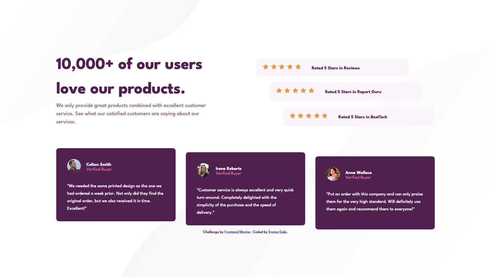

# Frontend Mentor - Social proof section solution

This is a solution to the [Social proof section challenge on Frontend Mentor](https://www.frontendmentor.io/challenges/social-proof-section-6e0qTv_bA). Frontend Mentor challenges help you improve your coding skills by building realistic projects.

## Table of contents

- [Overview](#overview)
  - [The challenge](#the-challenge)
  - [Screenshot](#screenshot)
  - [Links](#links)
- [My process](#my-process)
  - [Built with](#built-with)
  - [What I learned](#what-i-learned)
  - [Continued development](#continued-development)
  - [Useful resources](#useful-resources)
- [Author](#author)
- [Acknowledgments](#acknowledgments)

## Overview

### The challenge

Users should be able to:

- View the optimal layout for the section depending on their device's screen size

### Screenshot

### Links

- Solution URL: [github.com/emjogale/social-proof-section](https://github.com/emjogale/social-proof-section)
- Live Site URL: [social-proof-section-emjogale.vercel.app](https://social-proof-section-emjogale.vercel.app/)

## My process

### Built with

- Semantic HTML5 markup
- CSS custom properties
- Flexbox
- CSS Grid
- CUBE CSS

### What I learned

I watched Kevin Powell where he uses CUBE CSS on the Order Summary challenge and was really interested to try this approach myself. I don't know how much this particular challenge lends itself to CUBE but I had a go anyway. I really love the way `.flow > * + *` works! I was really taken by this - I used a border on this class initially to see the effect it has on a layout. I love the idea of using the cascade to 'flow' the styles. It makes so much sense! I have done a few challenges prior to this but this approach makes me realise I was kind of 'pixel pushing' on those and in my attempts to get the layout just right I was just tinkering around with the individual elements without too much thinking about the 'flow' of the whole page.

### Continued development

I'm really motivated now to check the CUBE methodology out more - I beleive it's the way forward!
Also Grid aned flex layouts - there's a lot to be learnt here beyond the basics....

### Useful resources

- [A look at the CUBE CSS methodology in action](https://www.youtube.com/watch?v=NanhQvnvbR8&t=1267s&ab_channel=KevinPowell) - A great video where Kevin Powell completes a FEM challenge using CUBE methodology
- [CUBE CSS](https://cube.fyi/)

## Author

- Frontend Mentor - [@emjogale](https://www.frontendmentor.io/profile/emjogale)
- Twitter - [@emmagale2635](https://www.twitter.com/emmagale2635)

## Acknowledgments
